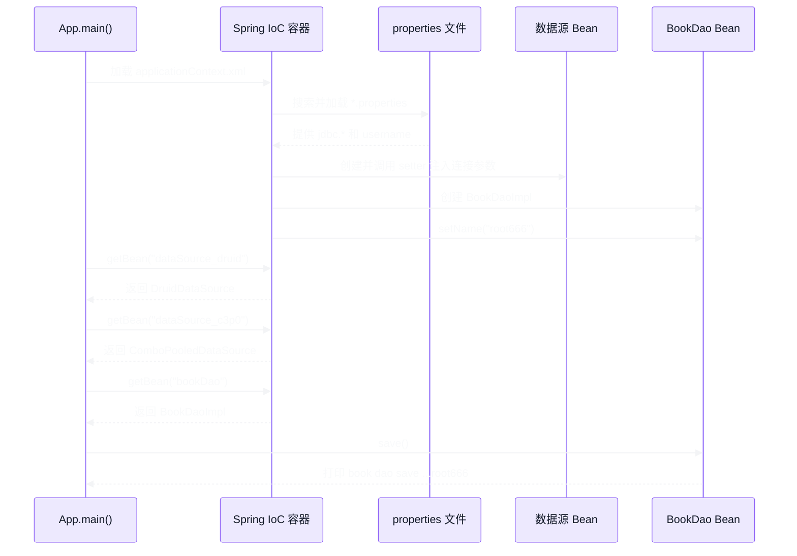

# 案例概览与运行流程

[下一篇 →](02-Maven依赖与DataSource.md)

> 先建立整体认识：案例定位、项目结构以及 Spring 容器的完整运行链路。

## 1. 案例定位

这个案例演示的是：**在传统 Spring Framework 项目中，使用 XML 配置让 Spring IoC 容器管理第三方数据源对象，并通过 properties 文件抽取配置项。**

它包含三个主要知识点：

1. 把 Druid、C3P0 这类第三方类交给 Spring 创建和管理；
2. 使用 `<property>` 调用 JavaBean 的 setter 方法完成依赖注入；
3. 使用 `<context:property-placeholder>` 加载 `.properties` 文件，并用 `${...}` 读取配置。

> 这不是 Spring Boot 案例。项目中没有 `spring-boot` 依赖、`@SpringBootApplication` 或 `application.yml`，容器是通过 `ClassPathXmlApplicationContext` 手动启动的。

此外，虽然项目名和配置涉及数据源，但当前代码**没有执行 SQL，也没有真正实现图书数据的持久化**。`BookDao.save()` 只打印一行文本，用来验证 Spring Bean 和 properties 属性注入是否成功。

---

## 2. 项目结构

```text
spring_09_datasource/
├── pom.xml
└── src/main
    ├── java/com/spring
    │   ├── App.java
    │   ├── AppSystemProperties.java
    │   └── dao
    │       ├── BookDao.java
    │       └── impl/BookDaoImpl.java
    └── resources
        ├── applicationContext.xml
        ├── jdbc.properties
        └── jdbc2.properties
```

各文件职责如下：

| 文件 | 作用 |
| --- | --- |
| `pom.xml` | 声明 Spring、Druid、C3P0、MySQL JDBC 驱动等依赖 |
| `App.java` | 启动 Spring 容器，从容器中获取 Bean 并验证配置 |
| `AppSystemProperties.java` | 当前为空，没有参与案例运行 |
| `BookDao.java` | DAO 接口，声明 `save()` 方法 |
| `BookDaoImpl.java` | DAO 实现，通过 setter 接收 `name` 属性 |
| `applicationContext.xml` | Spring 核心配置，创建数据源与 DAO Bean，加载 properties |
| `jdbc.properties` | 保存 JDBC 驱动、URL、用户名和密码 |
| `jdbc2.properties` | 提供普通属性 `username=root666` |

---

## 3. 整体运行流程



注意，Spring 在这里主要负责的是**对象的创建、属性赋值和生命周期管理**。真正的数据库连接由具体连接池在初始化或调用 `getConnection()` 时建立。

---

---

[下一篇 →](02-Maven依赖与DataSource.md)
